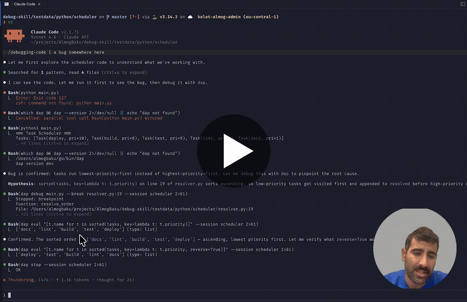

<p align="center">
  
</p>

<p align="center">
  <strong>Let your coding agent debug like a human developer.</strong><br>
  Set breakpoints, step through code, evaluate expressions — the way you actually debug.
</p>
<p align="center">
  <a href="https://github.com/AlmogBaku/debug-skill/releases/latest"></a>
  <a href="https://github.com/AlmogBaku/debug-skill/actions/workflows/release.yml"></a>
  <a href="https://github.com/AlmogBaku/debug-skill/blob/master/go.mod"></a>
  <a href="https://github.com/AlmogBaku/debug-skill/blob/master/LICENSE"></a>
  <a href="https://github.com/AlmogBaku/debug-skill/stargazers"></a>
</p>

<p align="center">
  If this saves you a debugging session, please <a href="https://github.com/AlmogBaku/debug-skill"><strong>star the repo</strong></a> — it helps others find it.
</p>

---

AI coding agents (Claude Code, Codex, Opencode, Cursor) are stuck with `print` statements and guesswork. **debug-skill** gives them what human developers have: a real debugger they can actually use. It ships two things:

- **Skills** — teach agents *how* to debug and set up the tooling
- **The `dap` CLI** — a stateless CLI wrapper around the [Debug Adapter Protocol](https://microsoft.github.io/debug-adapter-protocol/) so any agent can drive a real debugger from Bash

---

## Demo

[](https://youtu.be/ZxXvTtilZr0)

---

## Skills

| Skill | Purpose |
|---|---|
| `debugging-code` | The debugging workflow — breakpoints, stepping, inspection |
| `dap-setup` | Install `dap` and language backends, known limitations |

### Install for Claude Code

```
/plugin marketplace add AlmogBaku/debug-skill
/plugin install debugging-code@debug-skill-marketplace
/plugin install dap-setup@debug-skill-marketplace
```

### Install for other agents

Via [skills.sh](https://skills.sh) — works with Cursor, GitHub Copilot, Windsurf, Cline, and [20+ more agents](https://skills.sh/docs):

```bash
npx skills add AlmogBaku/debug-skill
```

Or manually copy the skill files from `skills/` into your agent's system prompt or context.

---

## The `dap` CLI

`dap` wraps the Debug Adapter Protocol behind simple, stateless CLI commands. A background daemon holds the session; the CLI sends one command and gets back the full context — no interactive terminal required.

### Install

```bash
bash <(curl -fsSL https://raw.githubusercontent.com/AlmogBaku/debug-skill/master/install.sh)
```

<details>
<summary>Other install methods</summary>

```bash
go install github.com/AlmogBaku/debug-skill/cmd/dap@latest
```

Or download a pre-built binary from the [releases page](https://github.com/AlmogBaku/debug-skill/releases/latest).

</details>

### Quick Start

```bash
dap debug app.py --break app.py:42   # start, stop at breakpoint
dap eval "len(items)"                 # inspect live state
dap step                              # step over
dap continue                          # run to next breakpoint
dap stop                              # end session
```

Every command returns **full context automatically**: location, source, locals, call stack, and output.

### Commands

| Command                       | Description                                     |
|-------------------------------|-------------------------------------------------|
| `dap debug <script>`          | Start debugging (local or `--attach host:port`) |
| `dap stop`                    | End session                                     |
| `dap step [in\|out\|over]`    | Step (default: over)                            |
| `dap continue`                | Resume execution                                |
| `dap context [--frame N]`     | Re-fetch current state                          |
| `dap eval <expr> [--frame N]` | Evaluate expression in current frame            |
| `dap output`                  | Drain buffered stdout/stderr since last stop    |

**Global flags:** `--json`, `--session <name>`, `--socket <path>`

### Supported Languages

| Language           | Backend     |
|--------------------|-------------|
| Python             | debugpy     |
| Go                 | dlv (Delve) |
| Node.js/TypeScript | js-debug    |
| Rust / C / C++     | lldb-dap    |

Backend is auto-detected from the file extension. Override with `--backend <name>`. See the `dap-setup` skill for backend install instructions and known limitations.

---

## Contributing

PRs and issues welcome. See `claudedocs/` for architecture details and `CLAUDE.md` for code conventions.

## License

MIT
